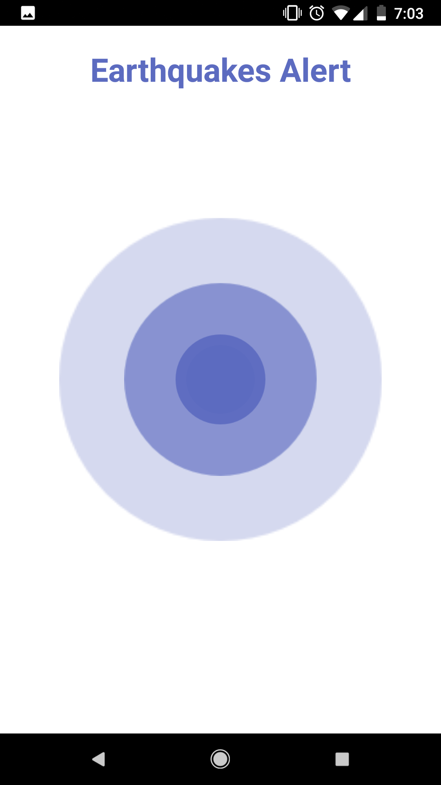
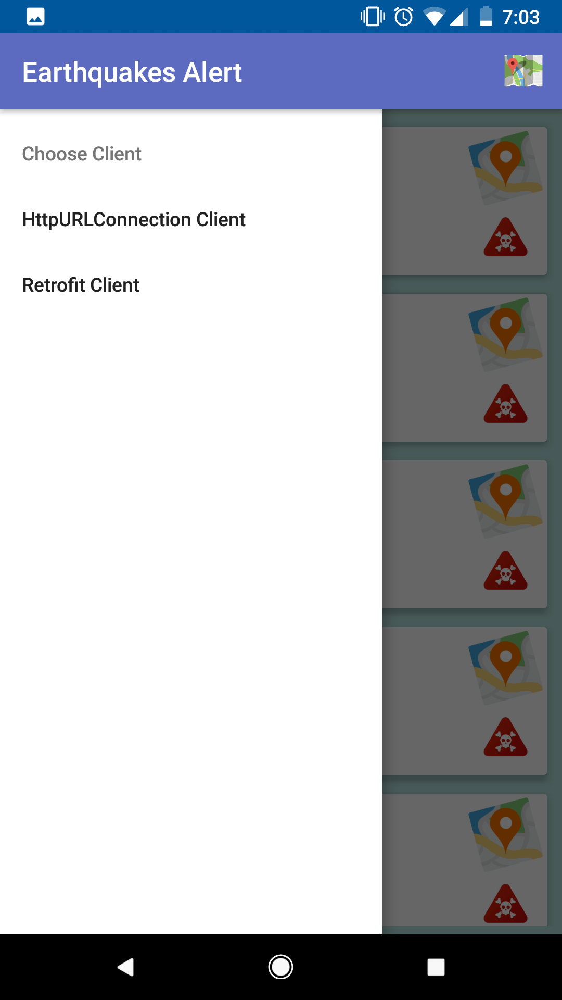
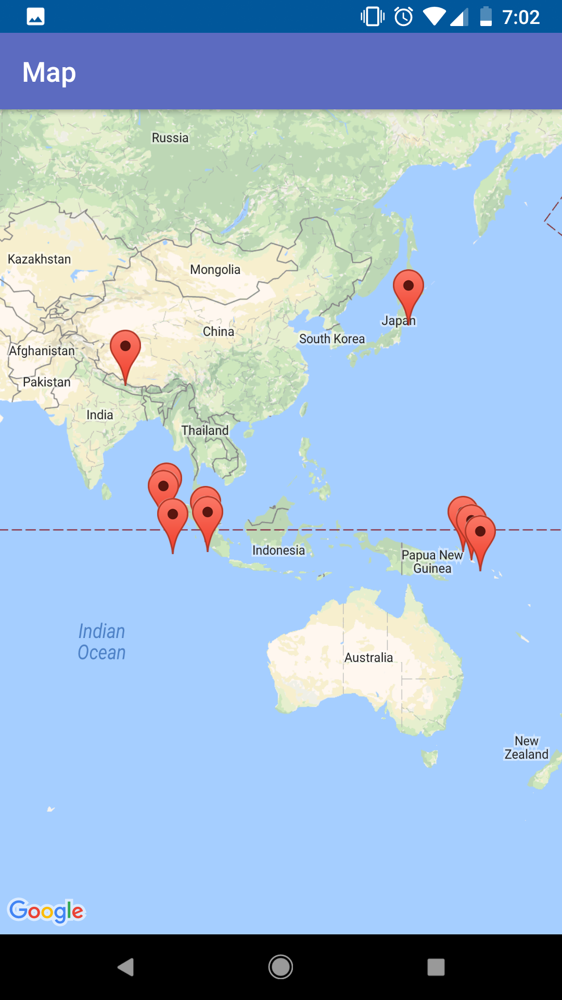
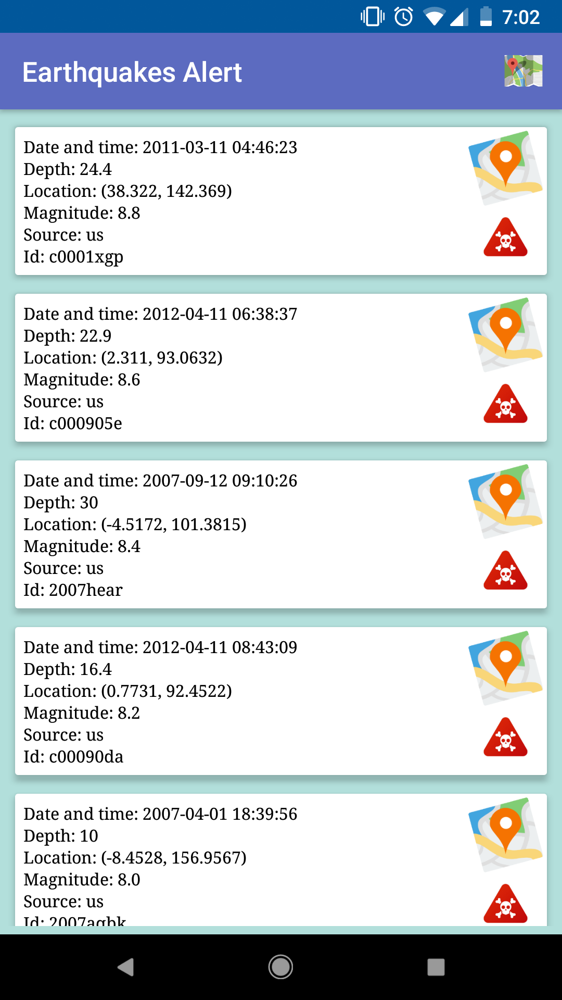

# EarhquakesAlert
This project demonstrates the use of some of the newest libraries available nowadays in Android.

# App Description
The project queries an open earthquakes' API and presents the results in a RecyclerView.
The main activity is a navigation activity and the left drawer provides 2 actions - load a native implementation of the view model, that is based on HttpURLConnection, or a Retroft2+RXJava2 view model.

# Design Patterns
I implemented the MainActivity with MVVM and data binding in order to connect between the View and the Model layer in a 
decoupled manner. Moreover, I used Dagger2 in order to inject the clients (which based on Retrofit or HttpURLConnection), that does all of the networking into the MainActivity's view model. That way it is easy to test the implementation of the MVVM component against mock clients.

# Important Libraries
1. RXJava2 - provides reactive programming paradigm for easy async / flowables / threads control capabilities. 
2. Retrofit2 - the leading network library nowadays, fully integrated with RXJava2.
3. Dagger2 - for dependency injection.

# Screenshots

   
   
   
   

